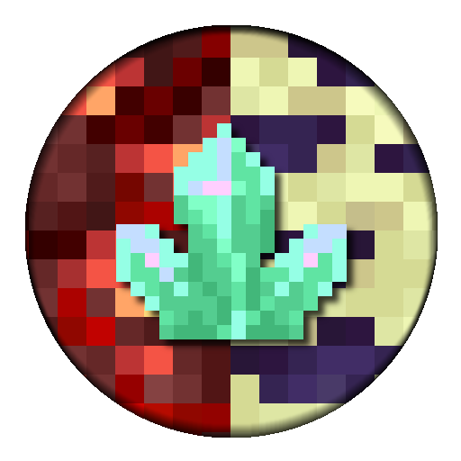
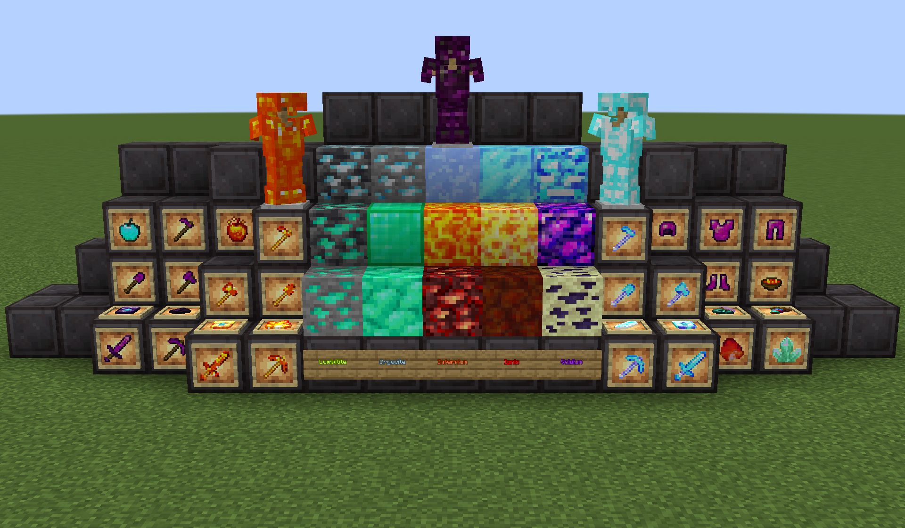

<p align="center"></p>

<h1 align="center">eXtra Ores & Items <br>
    <a href="https://github.com/junyali/extra-ores/actions/workflows/build.yml"></a>
    <a href="https://github.com/junyali/extra-ores/releases/"></a>
    <a href="https://github.com/junyali/extra-ores/blob/master/LICENSE"></a>
    <br>
    <a href="https://www.curseforge.com/minecraft/mc-mods/extra-ores-items"></a>
    <a href="https://modrinth.com/mod/extra-ores-items"></a>
    <br><br>
</h1>

<p>eXtra Ores & Items is a small QoL mod aimed to add a small variety of extra, well.. ores and items!</p>
<p>Ores can be found generated in all dimensions of Minecraft, with multiple unique recipes and equipment.</p>
<p>This mod is still in alpha, and is my first Minecraft mod :P</p>

<h2>Gallery <br><br>
    
    
    
    
    
    
    <br>
</h2>

<h2 align="center">Features <br></h2>
<ul>
    <li>New Luminitite, Infernium, Cryocite, and Voidium Ores which can be found naturally generated</li>
    <li>Respective toolsets and armour that goes beyond the netherite tier</li>
    <li>New food items that give special effects - some are randomised!</li>
    <li>New efficient source of fuel: Scorched Ignis Block</li>
</ul>

<h2 align="center">To do <br></h2>
<ul>
    <li>Add recipes ✅</li>
    <li>Add world generation ✅</li>
    <li>Add more functionality, balance stats of tools and armours 🔨</li>
    <li>Add consumables ✅</li>
    <li>Add new mobs! 🔨</li>
    <li>Convert block and item registries to DataGens (tried this once and gave up after like 3 hours due to lack of documentation) ❌</li>
</ul>

<h2 align="center">How to run / build <br></h2>
<h3>Requirements</h3>
<p><b>Fabric: </b>This mod was built on Fabric version 0.114.3+1.21.4</p>
<h3>Running</h3>
<p>Download the latest release <a href="https://github.com/junyali/extra-ores/releases">here</a>.</p>
<h3>Building</h3>
<p>This mod was developed on Intellij IDEA Ultimate, though may work with other Java IDEs that support the Gradle Build Tool</p>
<p>Importing from `build.gradle`, run:</p>

```console
$ ./gradlew
```
