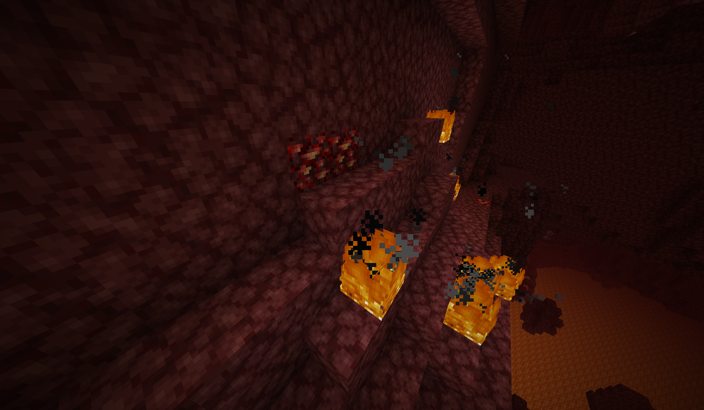
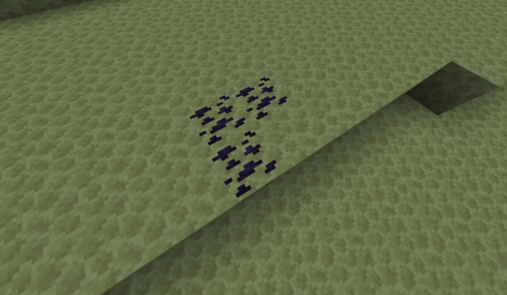

# eXtra Ores

A fun little (and the first) modification I have made for Minecraft on the Fabric mod loader! Adds new ores, items and their respective tools and armour sets to play around with.

## Preview





## Features

- Luminitite Ore, found in the overworld with glowing properties (WIP)
- Infernium Ore, found in the nether with fiery properties (WIP)
- Voidium Ore, found in the end (WIP)

## How to run / build

### Requirements

**Fabric:** This mod was built on Fabric version *0.114.3+1.21.4*

### Building

This mod was developed on Intellij IDEA Ultimate, though may work with other Java IDEs that support the Gradle Build Tool

Importing from `build.gradle`, run:

```console
$ ./gradlew
```
